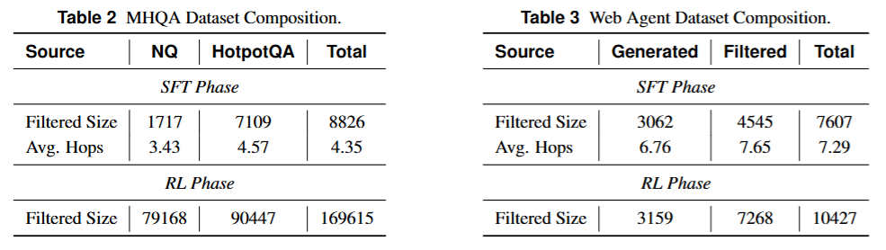

### Paper: Chain-of-Agents: End-to-End Agent Foundation Models via Multi-Agent Distillation and Agentic RL

## Experiments
实验分为 Web Agent 和 Code Agent 两部分。

### Web Agent
#### Experimental Setup
1. ***Training Dataset***
为了对比不同baseline的表现，构建了两类数据集，分别是
   - *MHQA Dataset*
    SFT阶段，从NQ和HotpotQA数据集中采样一系列数据，再经过轨迹合成以及质量过滤，得到8.8k条数据；
    RL阶段，采用和**Search-R1**一样的策略，使用全部的NQ和HotpotQA数据集
   - *Web Agent Dataset*

1. ***Benchmarks***

2. ***Metrics***

3. ***Implementation Details***

4. ***Baselines***

#### Experimental Results

### Code Agent

